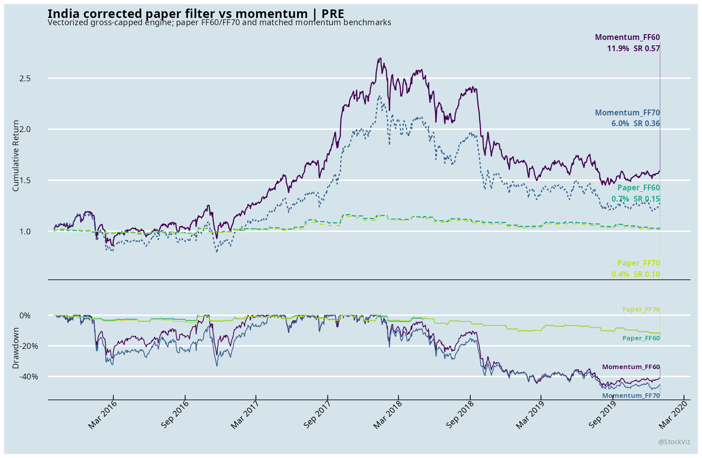
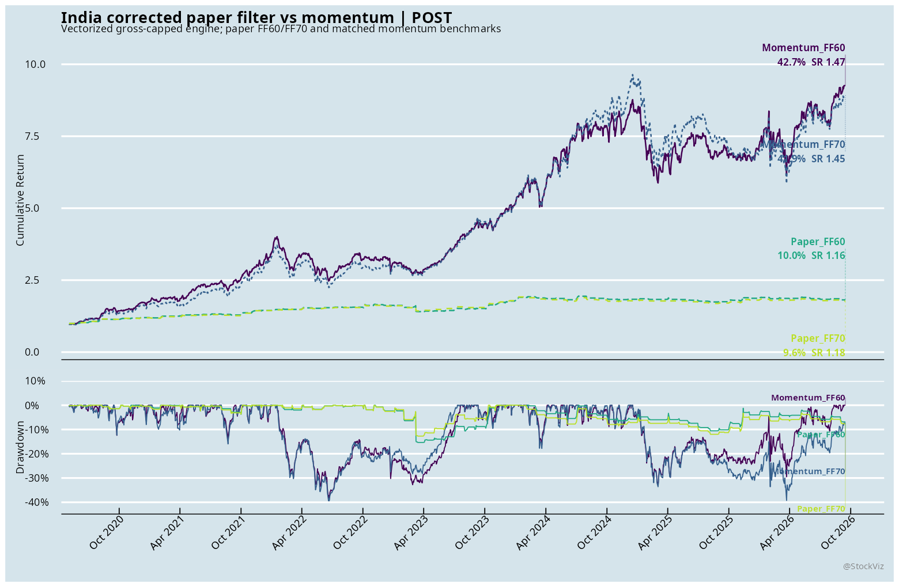
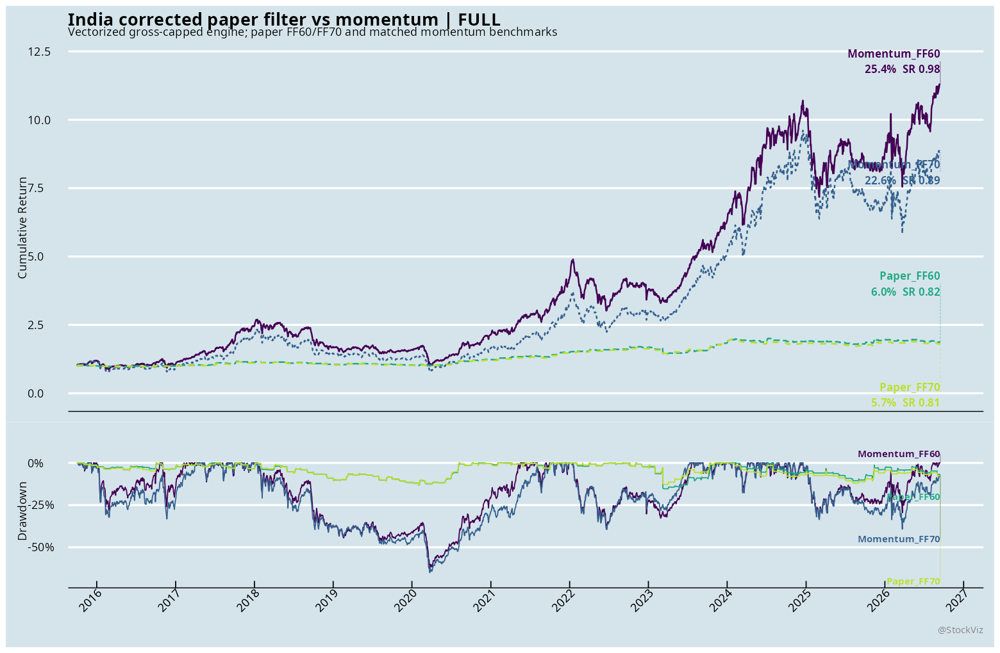
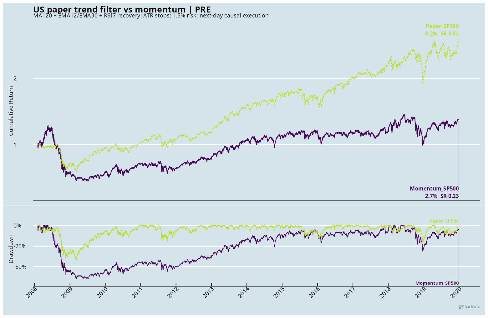
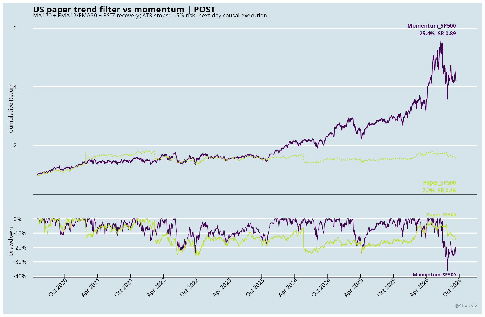
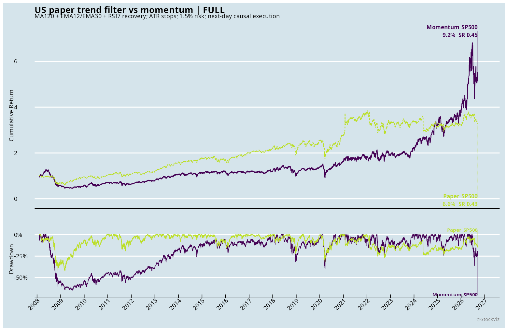

# Trend filtering and momentum signals

## Executive summary

The source paper is a small, low-frequency technical-strategy study on two Chinese bank stocks. It is not a cross-sectional stock-selection paper. The StockViz implementation broadens the idea to Indian and US equity universes, then compares the resulting event-driven strategy with a basic 365-calendar-day momentum portfolio.

The comparison is mixed. In both markets, the paper-style filter reduced drawdown relative to momentum, but it also gave up return in the US post period. The corrected India run uses an isolated vectorized event engine and enforces a 100% gross-exposure limit.

## 1. What the paper actually does

The paper reviewed is Shenhao Zhang, "A Low-Frequency Quantitative Trading Strategy Based on Trend Filtering and Momentum Signals: Empirical Evidence from A-Share Banking Stocks," published at ICDEIT 2025 (ACM DOI [10.1145/3788763.3788797](https://doi.org/10.1145/3788763.3788797)). The primary local source is:

`3788763.3788797.pdf`

The paper tests a long-only, event-driven strategy separately on:

- China Merchants Bank, 600036.SSE
- Ping An Bank, 000001.SZ

The reported sample runs from January 2021 through April 2023, with RMB 1,000,000 initial capital. The paper reports seven trades for Ping An Bank and nine for China Merchants Bank. It reports total returns of approximately 15.5%, annualized returns of approximately 6.61%, maximum drawdowns of approximately 6.82% and 9.94%, and Sharpe ratios of approximately 0.82 and 0.66.

The strategy combines four components:

1. A long-term trend filter: the close must be above SMA120.
2. A momentum condition: EMA12 must be above EMA30.
3. RSI7 pullback confirmation.
4. ATR-based risk management: initial and trailing stops, risk-based sizing, and target-volatility scaling.

The paper describes the strategy as low frequency because it produces few trades. It does not rank a broad universe and hold the top N names. That distinction matters: the StockViz work below is a declared broad-universe adaptation, not a literal reproduction of the paper's two-stock experiment.

### Signal and risk rules

The paper's explicit indicator parameters are:

| Component | Paper parameter | Implementation used here |
|---|---:|---|
| Long trend filter | SMA120 | Close above SMA120 |
| Fast EMA | 12 days | EMA12 > EMA30 |
| Slow EMA | 30 days | EMA12 > EMA30 |
| RSI | RSI7 | Recovery cross above 45 |
| Initial stop | 1.2 ATR | Entry price minus 1.2 × ATR14 |
| Trailing stop | 1.0 ATR | Highest price since entry minus 1.0 × current ATR14 |
| Volatility window | 60 days | Annualized volatility through the prior session |
| Target volatility | 12% | Scale down only; no leverage |
| Risk budget | 1.5% | 1.5% of current equity per position |
| Share rounding | 100-share Chinese lot | Whole shares; no 100-share restriction |

The paper does not fully specify the RSI state transition. Its parameter table uses 45, while another part of the paper describes 35 as the baseline. This implementation uses the parameter-table value and interprets confirmation as:

```text
close[t] > SMA120[t]
EMA12[t] > EMA30[t]
RSI7[t-1] <= 45 and RSI7[t] > 45
```

That recovery-cross rule is an explicit replication decision, not a claim that the paper published this exact Boolean expression.

The primary StockViz execution convention is causal: indicators are calculated through the signal close, the signal is decided after that close, and the order is executed on the next observed session. Stops are gap-aware. If the opening price is below the stop, the opening price is used; otherwise an intraday low breach is filled at the stop. The same day's high is not used to improve the stop before checking the low.

## 2. StockViz adaptation

| Market | Universe | Paper-style systems | Benchmark |
|---|---|---|---|
| India | Historical eligible equities, top 60% and top 70% by free-float market cap | Paper_FF60, Paper_FF70 | Momentum_FF60, Momentum_FF70 |
| US | Point-in-time S&P 500 constituents | Paper_SP500 | Momentum_SP500 |

The paper's daily stock-level entry logic is adapted to a monthly portfolio decision so that it can be compared with the existing momentum studies. At each month-end, eligible stocks are ranked and up to 20 names are selected. Positions then run through the daily stop and trend-exit logic. The benchmark uses the same date framework and a 365-calendar-day momentum formation window.

The India and US builds write signals, orders, daily returns, trades, metrics, coverage audits, and checkpoint files into their respective directories. `render.R` creates the cumulative-return/drawdown figures and color-coded metric tables.

Important data limitation: `BHAV_EQ_TD` exposes close-only US history in this environment. The US build therefore uses close as a proxy for open, high, and low. US ATR and stop results should be read as close-only bookkeeping, not as a full OHLC stop simulation.

## 3. Results

CAGR and volatility are annualized. MaxDD is the worst peak-to-trough drawdown. Turnover is the summed portfolio turnover measure in the source output. The post period begins on 2020-05-01; the pre period ends on 2019-12-31. The intervening 2020-01 through 2020-04 period is excluded.

### India: corrected vectorized run

The India results below come from the isolated vectorized implementation in `india/vectorized/`. It reused the audited month-end orders, rebuilt the daily OHLC/ATR/SMA inputs, and replaced repeated long-table scans with dense matrix state updates. The run covered 1,164 symbols and 4,302,603 price rows, produced 10,720 daily rows and 2,991 trades, and recorded a maximum paper exposure of 0.99999998 with zero exposure violations.

| System | Window | Observations | CAGR | Volatility | Sharpe | MaxDD | Turnover | Avg exposure |
|---|---|---:|---:|---:|---:|---:|---:|---:|
| Paper_FF60 | Pre | 3,700 | 0.5% | 3.4% | 0.17 | -11.6% | 0.00 | 4.0% |
| Paper_FF70 | Pre | 3,700 | 0.4% | 3.4% | 0.14 | -11.5% | 0.00 | 4.0% |
| Paper_FF60 | Post | 1,579 | 9.8% | 8.5% | 1.16 | -15.3% | 0.00 | 12.8% |
| Paper_FF70 | Post | 1,579 | 9.4% | 8.0% | 1.18 | -12.7% | 0.00 | 12.8% |
| Paper_FF60 | Full | 5,360 | 3.2% | 5.4% | 0.61 | -15.3% | 0.00 | 6.6% |
| Paper_FF70 | Full | 5,360 | 3.0% | 5.2% | 0.60 | -13.2% | 0.00 | 6.7% |

These corrected paper portfolios are lightly invested because the strategy only enters when the trend, EMA, and RSI conditions align. The low average exposure is part of the result, not an accounting error. The vectorized audit reports zero exposure violations.

#### India pre period



This figure shows the pre-2020 cumulative wealth paths and drawdowns. The corrected paper-style portfolios had low average exposure, about 4%, and produced modest positive returns with maximum drawdowns around 11.5% to 11.6%. The momentum benchmarks were invested continuously and therefore had higher return and substantially larger drawdowns.

#### India post period



The post-period chart shows the corrected trade-off. Paper_FF60 and Paper_FF70 produced 9.8% and 9.4% CAGR with maximum drawdowns of 15.3% and 12.7%, respectively, while the momentum benchmarks produced about 41% CAGR with drawdowns around 38% to 39%. The paper-style filter reduced participation and drawdown but did not beat momentum on return or Sharpe.

#### India full period



The full-history chart combines the modest pre-period result with the stronger post-period result. The corrected paper-style portfolios returned about 3% CAGR with maximum drawdowns between 13.2% and 15.3%, while the momentum portfolios had higher CAGR and higher drawdown. The dense-engine audit confirms that the paper portfolios stayed within the gross-exposure constraint.

### US: corrected run

| System | Window | Observations | CAGR | Volatility | Sharpe | MaxDD | Turnover | Avg exposure |
|---|---|---:|---:|---:|---:|---:|---:|---:|
| Paper_SP500 | Pre | 3,799 | 6.4% | 16.0% | 0.47 | -42.3% | 0.00 | 78.4% |
| Momentum_SP500 | Pre | 3,000 | 2.7% | 25.4% | 0.23 | -64.8% | 95.70 | 100.0% |
| Paper_SP500 | Post | 1,600 | 7.2% | 19.5% | 0.46 | -26.6% | 0.00 | 100.0% |
| Momentum_SP500 | Post | 1,600 | 25.3% | 30.7% | 0.89 | -36.0% | 45.10 | 100.0% |
| Paper_SP500 | Full | 5,482 | 5.6% | 17.9% | 0.40 | -42.3% | 0.00 | 84.9% |
| Momentum_SP500 | Full | 4,683 | 9.2% | 28.3% | 0.45 | -64.8% | 143.90 | 100.0% |

The US paper-style strategy reduced maximum drawdown relative to momentum in every window, but it also lagged momentum on post-period CAGR and Sharpe. Its full-period Sharpe was 0.40 versus 0.45 for momentum. The lower drawdown came with lower participation and, in the post period, a large return opportunity cost.

#### US pre period



The pre-period figure covers the history through 2019. The paper-style strategy has a smaller drawdown than momentum and a higher Sharpe, but the difference is not large enough to establish a robust advantage on its own.

#### US post period



The post-period figure is the clearest comparison. Momentum compounded at 25.3% CAGR with a 36.0% maximum drawdown, while the paper-style filter compounded at 7.2% with a 26.6% drawdown. The filter traded away much of the upside to reduce drawdown by roughly 9.4 percentage points.

#### US full period



Across the full sample, the paper-style filter produced a smoother but substantially lower-growth path. The drawdown improvement is meaningful, but the result does not show that the indicator combination beats basic momentum.

## 4. What can and cannot be concluded

The US result supports a narrow statement: in this implementation, the paper-style filters reduced drawdown relative to the matched momentum benchmark. It does not support the stronger claim that the strategy is a superior return strategy. Momentum had higher post-period CAGR and Sharpe.

For India, the corrected run shows the same broad pattern as the US run: the paper-style filter reduces participation and drawdown, but the basic momentum benchmark has the stronger return profile. The India paper-style Sharpe is about 1.16 to 1.18 post-2020 versus 1.45 to 1.47 for the momentum benchmark.

The original paper's evidence is also narrow. It uses two stocks, a short sample, and very few trades. It does not establish broad-universe generality, nor does it compare against a properly matched momentum portfolio. The RSI threshold conflict, incomplete entry specification, trailing-ATR convention, intraday stop ordering, and signal execution timing all require explicit choices. This implementation records those choices instead of presenting them as if they were fully specified by the source.

## 5. Reproducibility and audit files

| Output | Location |
|---|---|
| Shared build | `build.R` |
| India wrapper | `india/build.R` |
| US wrapper | `us/build.R` |
| Renderer | `render.R` |
| Findings source | `findings.md` |
| Chart manifest | `chart_manifest.csv` |
| India audit | `india/coverage_audit.csv` |
| Corrected vectorized India build | `india/vectorized/build.R` |
| Corrected vectorized India audit | `india/vectorized/coverage_audit.csv` |
| Corrected vectorized India metrics | `india/vectorized/metrics.csv` |
| Corrected vectorized India returns | `india/vectorized/daily_returns.csv` |
| Corrected vectorized India trades | `india/vectorized/trades.csv` |
| Corrected vectorized India checkpoint | `india/vectorized/checkpoint.rds` |
| US audit | `us/coverage_audit.csv` |
| Trade ledgers | `india/trades.csv`, `us/trades.csv` |
| Daily returns | `india/daily_returns.csv`, `us/daily_returns.csv` |
| Metric tables | `india/metrics.csv`, `us/metrics.csv` |
| Checkpoints | `india/checkpoint.rds`, `us/checkpoint.rds` |

The India findings now use the corrected vectorized run. The original `india/` outputs remain as historical producer artifacts; the final corrected India metrics are under `india/vectorized/`.
