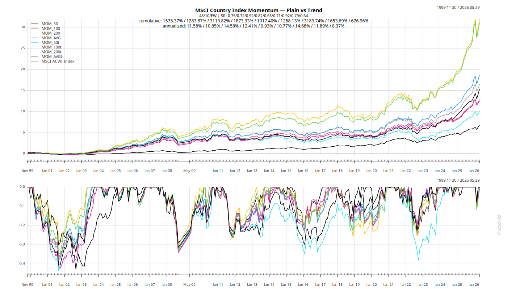
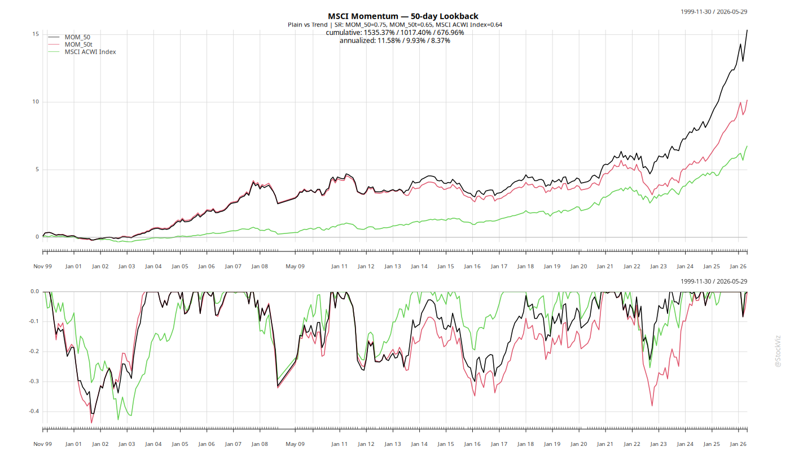
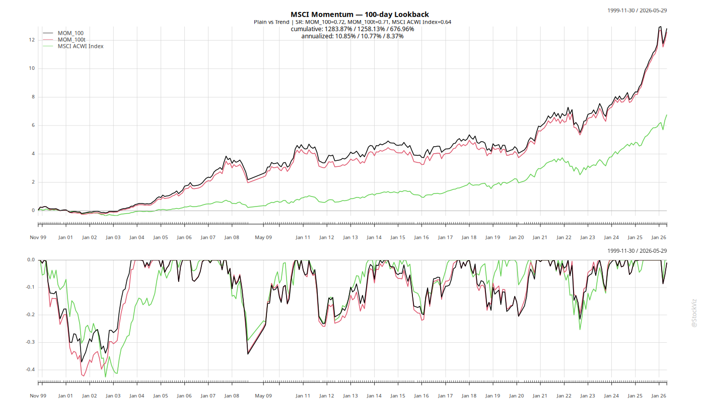
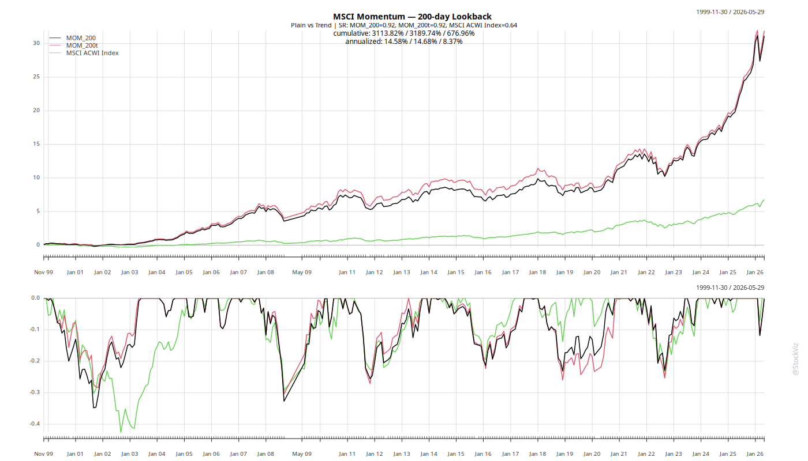
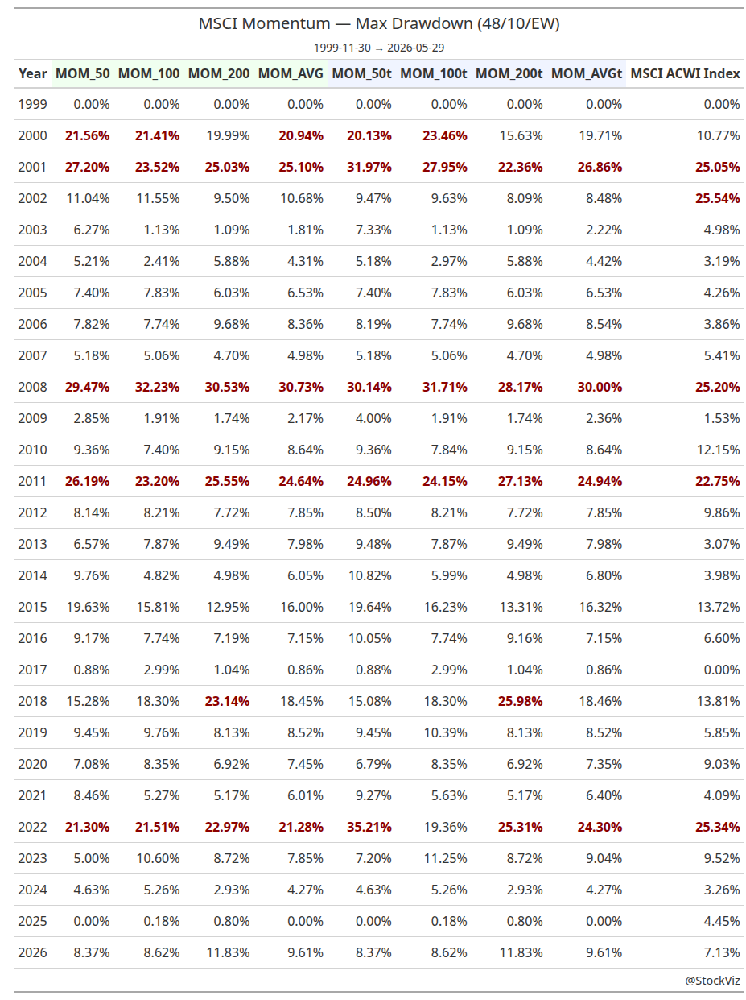

# Cross-Sectional Momentum — MSCI Country Equity Indices

Applies cross-sectional momentum to a universe of MSCI single-country large-cap
equity indices. At each month-end, selects the top 10 countries by rolling
Sharpe ratio and holds them equal-weight for the following month. Two variants
are tested: plain momentum and momentum filtered by a price-above-SMA trend
condition.

## Approach

**Universe:** Single-country MSCI large-cap equity indices with data predating
the median start date (to avoid survivorship-bias from late entrants). Typically
40–50 countries.

**Signal:** Rolling Sharpe ratio over a lookback window (50, 100, or 200 days),
evaluated at each month-end. The top 10 countries are selected for the next
month.

**Trend filter** (optional): The momentum selection is intersected with a
price-above-SMA condition — only countries trading above their N-day SMA are
eligible. This eliminates countries with strong trailing returns that are
already breaking down.

**Portfolio construction:** Equal-weight across selected countries. A 20 bp
drag is applied on turnover (churn between month-end selections).

**Benchmark:** MSCI ACWI Index buy & hold.

## Scripts

### `common.R`
Shared setup: libraries, DB connection, universe discovery, price loading,
rolling Sharpe and SMA computation. Caches results to `cache.Rdata` so both
momentum variants share the expensive computation.

### `script-mom.R`
Plain cross-sectional momentum. Picks top 10 by rolling Sharpe, no trend filter.
Output: cumulative chart, summary table, annual returns and drawdowns tables.

### `script-mom-tech.R`
Momentum + trend filter. Intersects the top-10 Sharpe selection with the set of
countries trading above their SMA. Output: same set of charts and tables with
"w/Trend" labels.

### `script-compare.R`
Loads results from both variants and generates side-by-side comparison charts
and tables. Groups by lookback period (50, 100, 200) and average.

## Running

```bash
cd "/mnt/data/blog/momentum/msci country indices"
Rscript script-mom.R          # plain momentum (creates cache.Rdata)
Rscript script-mom-tech.R     # momentum + trend (reuses cache)
Rscript script-compare.R      # side-by-side comparison
```

The first run builds `cache.Rdata` (DB queries + rolling metrics — the expensive
part). Subsequent runs or re-runs of the second script load the cache instantly.

## Results

All figures use a common date range where both plain and trend-filtered variants
have data. The benchmark is MSCI ACWI buy & hold on the same dates.

| Strategy    | Sharpe | Ann.Return | Max Drawdown |
|-------------|--------|------------|--------------|
| MOM_50      | 0.75   | 11.58%     | 40.66%       |
| MOM_100     | 0.72   | 10.85%     | 37.13%       |
| MOM_200     | 0.92   | 14.58%     | 34.81%       |
| MOM_AVG     | 0.82   | 12.41%     | 37.45%       |
| MOM_50t     | 0.65   |  9.93%     | 43.89%       |
| MOM_100t    | 0.71   | 10.77%     | 42.24%       |
| MOM_200t    | 0.92   | 14.68%     | 30.41%       |
| MOM_AVGt    | 0.79   | 11.89%     | 37.94%       |
| MSCI ACWI   | 0.64   |  8.37%     | 42.71%       |

**Key findings:**



1. **Longer lookbacks dominate.** Sharpe and returns increase monotonically
   from 50 → 100 → 200 days. The 200-day variant is the clear winner across
   both plain and trend-filtered variants.

   **50-day:** 
   **100-day:** 
   **200-day:** 

2. **Trend filter reduces drawdowns — but only for long lookbacks.** MOM_200t
   has the lowest drawdown at 30.41% (vs 34.81% for plain). On shorter
   lookbacks, the trend filter actually worsens drawdowns by reducing
   participation during strong trending periods.

3. **Trend filter hurts Sharpe on shorter lookbacks.** MOM_50 drops from
   0.75 to 0.65 when trend-filtered. The SMA condition eliminates too many
   candidates at high-churn short lookbacks.

4. **All variants beat buy & hold on risk-adjusted terms.** Every momentum
   variant has a higher Sharpe than ACWI (0.64). The 200-day plain and
   trend-filtered variants both achieve 0.92 Sharpe with ~14.6% annualized
   returns.

5. **Drawdowns remain the Achilles' heel.** Even the best variant (MOM_200t)
   has a 30% drawdown — high enough to rule out meaningful leverage. 

   

## Output

### Plain momentum (`script-mom.R`)
- `msci-country-index-momentum.cumret.png` — cumulative returns vs ACWI
- `msci-momentum-summary.png` — Sharpe, return, drawdown table
- `msci-momentum-annual.returns.table.png` — yearly returns
- `msci-momentum-annual.drawdowns.table.png` — yearly max drawdowns

### Momentum + trend (`script-mom-tech.R`)
- `msci-country-index-momentum-trend.cumret.png`
- `msci-momentum-trend-summary.png`
- `msci-momentum-trend-annual.returns.table.png`
- `msci-momentum-trend-annual.drawdowns.table.png`

### Comparison (`script-compare.R`)
- `msci-compare-all.cumret.png` — all 8 series vs ACWI
- `msci-compare-50.cumret.png` — MOM_50 vs MOM_50t vs ACWI
- `msci-compare-100.cumret.png` — MOM_100 vs MOM_100t vs ACWI
- `msci-compare-200.cumret.png` — MOM_200 vs MOM_200t vs ACWI
- `msci-compare-avg.cumret.png` — MOM_AVG vs MOM_AVGt vs ACWI
- `msci-compare-summary.png` — combined metrics table
- `msci-compare-annual.returns.table.png` — yearly returns (all variants)
- `msci-compare-annual.drawdowns.table.png` — yearly drawdowns (all variants)

## Data files

- `cache.Rdata` — shared cache (prices, rolling Sharpe, SMA)
- `momentum.Rdata` — plain momentum portfolio returns
- `momentum-trend.Rdata` — trend-filtered momentum portfolio returns
