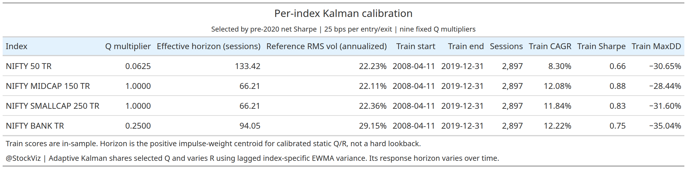
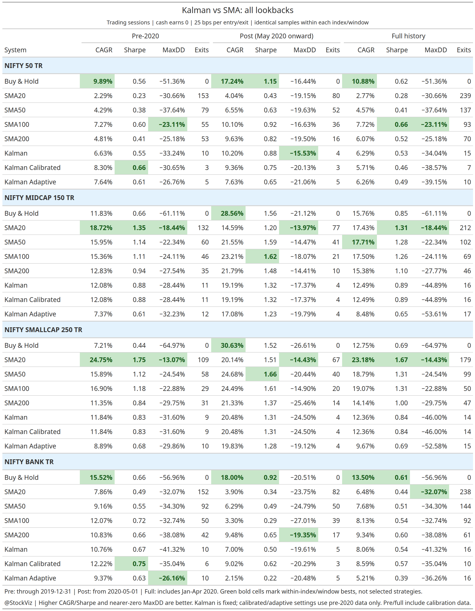

# Fixed, calibrated and adaptive Kalman vs SMA20/50/100/200

Run from this directory:

    Rscript tests.R
    Rscript build.R
    Rscript verify.R

The entry point is build.R. engine.R contains the fixed rules; tests.R checks causal timing and accounting; verify.R reconciles the generated market-data artifacts. Dependencies and the StockViz shared runtime/metrics/chart modules are sourced at the top of the scripts.

## Universe and rules

The primary universe is NIFTY 50 TR, NIFTY MIDCAP 150 TR, NIFTY SMALLCAP 250 TR and NIFTY BANK TR. Each index has Buy & Hold, SMA20, SMA50, SMA100, SMA200, Kalman, Kalman Calibrated and Kalman Adaptive arms on an identical within-index evaluation sample. SMA lookbacks count trading sessions, not calendar days. The original Kalman arm remains a fixed-parameter control; the two new arms use per-index pre-2020 calibration.

The supplied article specifies a two-state local-linear filter on log prices:

    F = [1 1; 0 1]
    H = [1 0]
    Q = diag(0.0001, 0.0001) * 0.01^2
    R = 300 * 0.01^2

The covariance update uses Joseph form. Every Kalman arm enters on strictly positive slope and exits on strictly negative slope. Each SMA arm enters above its own moving average and exits below it. Equality retains the previous state. SMA and the original Kalman arm are unfitted controls. The proprietary fitted-yearly twin cannot be replicated from the article's incomplete grid description and is not included; the calibration below is a separate, explicitly specified experiment.

Kalman has no fixed lookback window. It recursively updates its level and slope estimates using all prior closes, with older observations having diminishing influence. The deterministic impulse check gives a positive-weight centroid of about 66.2 trading sessions, consistent with the article's approximate horizon. This is an effective response horizon, not a rolling 66-session cutoff. Its signed-weight centroid differs because the local-linear filter has a negative tail. impulse_weights.csv stores both the Kalman weights and the normalized triangular SMA200 distance weights.

The 504-session warm-up is the period before performance scoring begins, not Kalman's lookback. The fixed control uses the same approximately 66.2-session effective horizon for all indices. Calibrated Kalman can have a different horizon for each index, while adaptive Kalman changes its response through time. No Kalman arm uses a separate configuration for each SMA horizon.

### Per-index calibration and volatility adaptation

For each index, the script evaluates nine process-noise multipliers: `2^seq(-8, 8, by=2)`. Each candidate uses `Q = Q_original * multiplier` and the original fixed R. It chooses the highest finite net Sharpe after the 504-session warm-up using data through December 31, 2019, with 25 bps charged per entry/exit. Ties favor shallower MaxDD, then the original grid order. At least 252 scored training sessions are required. The selected multiplier stays fixed after the cutoff and is reused in both cost cases. Independent calibration can select the same multiplier for multiple indices; it does not force their settings to differ.

Kalman Calibrated uses the selected Q and fixed R. Kalman Adaptive shares that Q but updates measurement noise for every close:

    log_return_t = log(close_t / close_(t-1))
    v_t = lambda * v_(t-1) + (1 - lambda) * log_return_t^2
    lambda = 2^(-1/20)
    reference_variance = mean(pre-2020 log_return^2)
    R_t = R_original * clip(v_(t-1) / reference_variance, 0.25, 4)

The EWMA has a fixed 20-session half-life and starts at `0.01^2`. The update at close t uses variance known at the preceding close, excluding the current return. The reference variance comes only from that index's training history, including warm-up observations; its reported annualized RMS volatility is `sqrt(252 * reference_variance)`. The Kalman covariance starts at steady state for the selected Q and original R, then follows the Joseph update under the time-varying R. Targets still earn only the following close-to-close return.

This adaptation treats higher return volatility as noisier measurements and increases R to reduce responsiveness. It is a deliberate noise-suppression hypothesis, not an estimate that separates true price movement from measurement error. It can delay exits during a crash and may worsen drawdown. Scaling Q and R proportionally would leave the steady-state gain unchanged, so this experiment changes their relative balance instead. The adaptive arm's horizon is not a constant or exactly the calibrated static horizon; that static horizon is only a reference.

Calibration and the volatility reference use the full pre-2020 training sample. Pre metrics for the new arms are therefore in-sample, and full metrics mix calibration and later data. The holdout settings are frozen; only past-volatility updates continue. The existing post window starts May 1, 2020 and omits the initial pandemic crash. It is a historical holdout comparison, not prospective validation. The volatility rule, half-life and bounds were fixed before evaluating post results and were not optimized on them.

Method reference: Greg Welch and Gary Bishop, *An Introduction to the Kalman Filter*, UNC-Chapel Hill TR 95-041 (July 24, 2006), for the role of process and measurement noise covariances. The return-volatility rule above is this study's heuristic, not a rule prescribed by that reference.

Each close-t target applies to the following close-to-close return, with exactly one lag. The backtest starts after 504 observed warm-up sessions. The initial portfolio starts in cash and pays its entry cost. State and positions continue across year boundaries; the script does not add artificial annual exits and re-entries. Terminal open positions are not liquidated. These explicit boundary conventions differ from the article's incompletely specified yearly engine.

Cash earns zero. The main case subtracts 25 bps per absolute applied-position change; a separate 2-bps case preserves the article's cost assumption. These are index timing returns, not verified next-open ETF fills. Taxes, tracking error and capacity are not modeled.

Pre runs through December 31, 2019; post begins May 1, 2020. Full includes January-April 2020. The filter continues through those gap months even when they are omitted from split metrics. Shared house metrics use PerformanceAnalytics with 252-session annualization and a zero cash hurdle. MaxDD is displayed as a negative number, so values closer to zero receive greener cells.

## Data modes

The default run deliberately reads recorded local caches:

    /mnt/data/blog/technical/trend-vix-lookback/cache.rds
    /mnt/data/blog/technical/trend-vix-sectors/cache.rds

They contain observed index levels through July 31, 2026. Their original calendar/cash alignment truncates earlier database history; the evaluation starts in April 2008 after warm-up. The run does not claim fresh October prices. source_provenance.csv records the source path, hash and actual retained range.

For a fresh StockViz query, point STOCKVIZ_R_CONFIG at the existing R config that defines ldbserver, ldbuser and ldbpassword, then run:

    Rscript build.R --refresh

The live query requests exact bhav_index identifiers and fails if a series is absent. The default config path is /mnt/hollandC/StockViz/R/config.r. That path is absent in this environment, so the cached build is verified but live refresh remains blocked. Never put credentials in this directory or in command-line arguments.

The optional volatility-switch factor cache is not used: its MOMENTUM50_TR column exactly matches independent NIFTY 50 TR levels on all 3,684 overlapping observations. Using its label would produce a false extra index. This study does not modify that upstream cache or silently swap its columns.

## Replication limits

This is an Indian total-return adaptation, not a byte-identical reproduction of the proprietary QuanterLab engine. The article uses dividend-excluding US prices and yearly windows; this study uses Indian TR indices and continuous positions. The article does not disclose its initial covariance and state. Here covariance is solved at steady state without market data, level is seeded at the first log close, and slope starts at zero.

The cached inputs retain their original common-calendar and cash-coverage sample. Backfilled index histories may predate index launch and do not establish an investable point-in-time constituent portfolio. Historical pre/post slices are not prospective validation.

A close-t decision applied to the following close-to-close return assumes execution at that boundary close. A next-open implementation needs OHLC data and a different return basis. The index simulation does not model opening gaps or ETF tracking error.

## Outputs

The results section below contains measured pre/post/full tables and embedded cumulative-plus-drawdown charts. The build refreshes that section from the final metrics while preserving the instructions and methodology above.

Artifacts in output/ include:

- checkpoint.rds: filtered signals, applied positions, gross/net returns, costs and provenance.
- metrics_{pre,post,full}.csv, .html and .png: three blue-grouped, color-coded metric tables covering all eight arms.
- calibration.csv, .html and .png: selected per-index settings, reference RMS volatility, static effective horizons and in-sample scores.
- calibration_candidates.csv: all nine candidates per index, including the selected flag and training dates.
- metrics_consolidated.csv, .html and .png: one table grouped by index with pre/post/full CAGR, Sharpe, MaxDD and exits side by side.
- Twelve cum_dd_{window}_{index}.png files: shared economist/viridis charts with CAGR/Sharpe end labels, drawdown levels and @StockViz captions.
- daily_returns.csv, daily_exposure.csv and signals.csv: auditable timing and cost paths, including calibrated/adaptive targets and lagged adaptive variance/R multipliers.
- cost_sensitivity.csv: all 25-bps and 2-bps comparisons.
- annual_returns.csv: compounded daily returns, with opening/terminal years marked partial.
- falls.csv: retrospective >=15% record-peak episodes, exit-signal delay and false starts before the trough.
- chart_manifest.csv and source_provenance.csv: exact chart samples and source records.

You can omit PNG tables with --no-png-tables when a headless browser is unavailable. That is a reduced-output run; verify.R intentionally requires the full PNG deliverables.

The report describes a historical fixed-rule adaptation, not a prospective experiment or an investable constituent-level replication. Compare arms within each index and window before comparing unequal-history index summaries.

<!-- BEGIN GENERATED RESULTS -->
## Results

### Source coverage

| Index | First cached close | Last cached close | Rows |
|---|---|---|---:|
| NIFTY 50 TR | 2006-04-10 | 2026-07-31 | 5036 |
| NIFTY MIDCAP 150 TR | 2006-04-10 | 2026-07-31 | 5036 |
| NIFTY SMALLCAP 250 TR | 2006-04-10 | 2026-07-31 | 5036 |
| NIFTY BANK TR | 2006-04-10 | 2026-07-31 | 5036 |

### Per-index calibration

Each index chooses its own Q multiplier using pre-2020 net Sharpe. The fixed Kalman control retains its original parameters. Calibrated and adaptive Kalman share the selected Q; only the adaptive arm changes R through time. These training scores include the data used for selection.

| Index | Selected Q multiplier | Static effective horizon (sessions) | Reference annualized RMS vol |
|---|---:|---:|---:|
| NIFTY 50 TR | 0.062500 | 133.42 | 22.23% |
| NIFTY MIDCAP 150 TR | 1.000000 | 66.21 | 22.11% |
| NIFTY SMALLCAP 250 TR | 1.000000 | 66.21 | 22.36% |
| NIFTY BANK TR | 0.250000 | 94.05 | 29.15% |

### Calibrated and adaptive findings

The comparison below uses the unchanged post window (May 1, 2020 onward). It excludes January-April 2020, including the initial pandemic crash; do not read it as a complete 2020-onward crisis test. No post data enter calibration.

| Index | Kalman variant | Post CAGR | Post Sharpe | Post MaxDD | Post exits |
|---|---|---:|---:|---:|---:|
| NIFTY 50 TR | Kalman | 10.20% | 0.88 | -15.53% | 4 |
| NIFTY 50 TR | Kalman Calibrated | 9.36% | 0.75 | -20.13% | 3 |
| NIFTY 50 TR | Kalman Adaptive | 7.63% | 0.65 | -21.06% | 5 |
| NIFTY MIDCAP 150 TR | Kalman | 19.19% | 1.32 | -17.37% | 4 |
| NIFTY MIDCAP 150 TR | Kalman Calibrated | 19.19% | 1.32 | -17.37% | 4 |
| NIFTY MIDCAP 150 TR | Kalman Adaptive | 17.08% | 1.23 | -19.79% | 4 |
| NIFTY SMALLCAP 250 TR | Kalman | 20.48% | 1.31 | -24.50% | 4 |
| NIFTY SMALLCAP 250 TR | Kalman Calibrated | 20.48% | 1.31 | -24.50% | 4 |
| NIFTY SMALLCAP 250 TR | Kalman Adaptive | 19.83% | 1.28 | -19.12% | 4 |
| NIFTY BANK TR | Kalman | 7.00% | 0.50 | -19.61% | 5 |
| NIFTY BANK TR | Kalman Calibrated | 9.02% | 0.62 | -20.29% | 3 |
| NIFTY BANK TR | Kalman Adaptive | 2.15% | 0.22 | -20.48% | 5 |

NIFTY 50 TR: calibrated minus fixed post Sharpe -0.14 and MaxDD -4.60 percentage points; adaptive minus calibrated post Sharpe -0.10 and MaxDD -0.93 points. A positive MaxDD difference means a shallower drawdown. Adaptation is not assumed to improve the result.

NIFTY MIDCAP 150 TR: calibrated minus fixed post Sharpe +0.00 and MaxDD +0.00 percentage points; adaptive minus calibrated post Sharpe -0.09 and MaxDD -2.42 points. A positive MaxDD difference means a shallower drawdown. Adaptation is not assumed to improve the result.

NIFTY SMALLCAP 250 TR: calibrated minus fixed post Sharpe +0.00 and MaxDD +0.00 percentage points; adaptive minus calibrated post Sharpe -0.03 and MaxDD +5.38 points. A positive MaxDD difference means a shallower drawdown. Adaptation is not assumed to improve the result.

NIFTY BANK TR: calibrated minus fixed post Sharpe +0.12 and MaxDD -0.68 percentage points; adaptive minus calibrated post Sharpe -0.40 and MaxDD -0.19 points. A positive MaxDD difference means a shallower drawdown. Adaptation is not assumed to improve the result.

### Consolidated metrics

Each index group contains Buy & Hold, SMA20, SMA50, SMA100, SMA200 and three Kalman variants (fixed, calibrated and adaptive). Green cells mark the highest CAGR/Sharpe or shallowest MaxDD within that index and window. These are descriptive comparisons, not a lookback selection rule.

### Additional lookback findings

The shorter horizons use 20, 50, 100 trading sessions. All arms retain the 504-session warm-up and identical evaluation dates. Shorter lookbacks do not receive a longer scoring sample. SMA and fixed Kalman remain unfitted controls; calibrated/adaptive Kalman use pre-2020 calibration. Post/full rankings must not be treated as prospective validation.

- NIFTY 50 TR: among the added horizons, SMA100 has the highest full-history Sharpe (0.66), with CAGR 7.72% and MaxDD -23.11%; SMA200 records 0.52, 6.07% and -25.18%. The shallowest added-horizon drawdown is SMA100 at -23.11%. Added-horizon exits range from 93 to 239, versus 70 for SMA200. The highest-Sharpe SMA is SMA100 pre-2020 and SMA100 post-May-2020.

- NIFTY MIDCAP 150 TR: among the added horizons, SMA20 has the highest full-history Sharpe (1.31), with CAGR 17.43% and MaxDD -18.44%; SMA200 records 1.10, 15.38% and -27.77%. The shallowest added-horizon drawdown is SMA20 at -18.44%. Added-horizon exits range from 69 to 212, versus 46 for SMA200. The highest-Sharpe SMA is SMA20 pre-2020 and SMA100 post-May-2020.

- NIFTY SMALLCAP 250 TR: among the added horizons, SMA20 has the highest full-history Sharpe (1.67), with CAGR 23.18% and MaxDD -14.43%; SMA200 records 1.00, 14.14% and -29.75%. The shallowest added-horizon drawdown is SMA20 at -14.43%. Added-horizon exits range from 50 to 179, versus 47 for SMA200. The highest-Sharpe SMA is SMA20 pre-2020 and SMA50 post-May-2020.

- NIFTY BANK TR: among the added horizons, SMA100 has the highest full-history Sharpe (0.54), with CAGR 8.13% and MaxDD -32.74%; SMA200 records 0.60, 9.34% and -38.08%. The shallowest added-horizon drawdown is SMA20 at -32.07%. Added-horizon exits range from 92 to 238, versus 61 for SMA200. The highest-Sharpe SMA is SMA100 pre-2020 and SMA200 post-May-2020.

Shorter averages can exit sooner, but repeated boundary crossings incur more 25-bps charges. Inspect cost_sensitivity.csv for the separate 2-bps case before attributing a result to signal speed alone. The original SMA200 and Kalman paths are unchanged; adding alternatives does not improve either rule retroactively.

### pre results

| Index | System | CAGR | Sharpe | MaxDD | Invested | Exits |
|---|---|---:|---:|---:|---:|---:|
| NIFTY 50 TR | Buy & Hold | 9.89% | 0.56 | -51.36% | 100.0% | 0 |
| NIFTY 50 TR | SMA20 | 2.29% | 0.23 | -30.66% | 59.6% | 153 |
| NIFTY 50 TR | SMA50 | 4.29% | 0.38 | -37.64% | 63.8% | 79 |
| NIFTY 50 TR | SMA100 | 7.27% | 0.60 | -23.11% | 64.6% | 55 |
| NIFTY 50 TR | SMA200 | 4.81% | 0.41 | -25.18% | 70.3% | 53 |
| NIFTY 50 TR | Kalman | 6.63% | 0.55 | -33.24% | 64.6% | 10 |
| NIFTY 50 TR | Kalman Calibrated | 8.30% | 0.66 | -30.65% | 74.8% | 3 |
| NIFTY 50 TR | Kalman Adaptive | 7.64% | 0.61 | -26.76% | 72.9% | 5 |
| NIFTY MIDCAP 150 TR | Buy & Hold | 11.83% | 0.66 | -61.11% | 100.0% | 0 |
| NIFTY MIDCAP 150 TR | SMA20 | 18.72% | 1.35 | -18.44% | 60.8% | 132 |
| NIFTY MIDCAP 150 TR | SMA50 | 15.95% | 1.14 | -22.34% | 63.0% | 60 |
| NIFTY MIDCAP 150 TR | SMA100 | 15.36% | 1.11 | -24.11% | 60.2% | 46 |
| NIFTY MIDCAP 150 TR | SMA200 | 12.83% | 0.94 | -27.54% | 64.2% | 35 |
| NIFTY MIDCAP 150 TR | Kalman | 12.08% | 0.88 | -28.44% | 62.2% | 11 |
| NIFTY MIDCAP 150 TR | Kalman Calibrated | 12.08% | 0.88 | -28.44% | 62.2% | 11 |
| NIFTY MIDCAP 150 TR | Kalman Adaptive | 7.37% | 0.61 | -32.23% | 60.1% | 12 |
| NIFTY SMALLCAP 250 TR | Buy & Hold | 7.21% | 0.44 | -64.97% | 100.0% | 0 |
| NIFTY SMALLCAP 250 TR | SMA20 | 24.75% | 1.75 | -13.07% | 58.4% | 109 |
| NIFTY SMALLCAP 250 TR | SMA50 | 15.89% | 1.12 | -24.54% | 59.1% | 58 |
| NIFTY SMALLCAP 250 TR | SMA100 | 16.90% | 1.18 | -22.88% | 56.0% | 29 |
| NIFTY SMALLCAP 250 TR | SMA200 | 11.35% | 0.84 | -29.75% | 55.9% | 31 |
| NIFTY SMALLCAP 250 TR | Kalman | 11.84% | 0.83 | -31.60% | 56.7% | 9 |
| NIFTY SMALLCAP 250 TR | Kalman Calibrated | 11.84% | 0.83 | -31.60% | 56.7% | 9 |
| NIFTY SMALLCAP 250 TR | Kalman Adaptive | 8.89% | 0.68 | -29.86% | 56.5% | 10 |
| NIFTY BANK TR | Buy & Hold | 15.52% | 0.66 | -56.96% | 100.0% | 0 |
| NIFTY BANK TR | SMA20 | 7.86% | 0.49 | -32.07% | 58.1% | 152 |
| NIFTY BANK TR | SMA50 | 9.16% | 0.55 | -34.30% | 62.1% | 92 |
| NIFTY BANK TR | SMA100 | 12.07% | 0.72 | -32.74% | 62.5% | 50 |
| NIFTY BANK TR | SMA200 | 10.83% | 0.66 | -38.08% | 67.3% | 42 |
| NIFTY BANK TR | Kalman | 10.76% | 0.67 | -41.32% | 63.3% | 10 |
| NIFTY BANK TR | Kalman Calibrated | 12.22% | 0.75 | -35.04% | 69.0% | 6 |
| NIFTY BANK TR | Kalman Adaptive | 9.37% | 0.63 | -26.16% | 63.2% | 10 |

#### NIFTY 50 TR

Kalman minus SMA200: CAGR +1.83 percentage points, Sharpe +0.13, MaxDD -8.05 points (positive means shallower). Exits: 10 vs 53. Lower turnover is not itself evidence of higher return or better drawdown control.

#### NIFTY MIDCAP 150 TR

Kalman minus SMA200: CAGR -0.74 percentage points, Sharpe -0.05, MaxDD -0.90 points (positive means shallower). Exits: 11 vs 35. Lower turnover is not itself evidence of higher return or better drawdown control.

#### NIFTY SMALLCAP 250 TR

Kalman minus SMA200: CAGR +0.48 percentage points, Sharpe -0.01, MaxDD -1.85 points (positive means shallower). Exits: 9 vs 31. Lower turnover is not itself evidence of higher return or better drawdown control.

#### NIFTY BANK TR

Kalman minus SMA200: CAGR -0.08 percentage points, Sharpe +0.01, MaxDD -3.25 points (positive means shallower). Exits: 10 vs 42. Lower turnover is not itself evidence of higher return or better drawdown control.

### post results

| Index | System | CAGR | Sharpe | MaxDD | Invested | Exits |
|---|---|---:|---:|---:|---:|---:|
| NIFTY 50 TR | Buy & Hold | 17.24% | 1.15 | -16.44% | 100.0% | 0 |
| NIFTY 50 TR | SMA20 | 4.04% | 0.43 | -19.15% | 63.0% | 80 |
| NIFTY 50 TR | SMA50 | 6.55% | 0.63 | -19.63% | 66.9% | 52 |
| NIFTY 50 TR | SMA100 | 10.10% | 0.92 | -16.63% | 71.0% | 36 |
| NIFTY 50 TR | SMA200 | 9.63% | 0.82 | -19.50% | 78.6% | 16 |
| NIFTY 50 TR | Kalman | 10.20% | 0.88 | -15.53% | 73.7% | 4 |
| NIFTY 50 TR | Kalman Calibrated | 9.36% | 0.75 | -20.13% | 83.5% | 3 |
| NIFTY 50 TR | Kalman Adaptive | 7.63% | 0.65 | -21.06% | 75.0% | 5 |
| NIFTY MIDCAP 150 TR | Buy & Hold | 28.56% | 1.56 | -21.12% | 100.0% | 0 |
| NIFTY MIDCAP 150 TR | SMA20 | 14.59% | 1.20 | -13.97% | 67.7% | 77 |
| NIFTY MIDCAP 150 TR | SMA50 | 21.55% | 1.59 | -14.47% | 71.4% | 41 |
| NIFTY MIDCAP 150 TR | SMA100 | 23.21% | 1.62 | -18.07% | 76.3% | 21 |
| NIFTY MIDCAP 150 TR | SMA200 | 21.79% | 1.48 | -14.41% | 82.6% | 10 |
| NIFTY MIDCAP 150 TR | Kalman | 19.19% | 1.32 | -17.37% | 76.4% | 4 |
| NIFTY MIDCAP 150 TR | Kalman Calibrated | 19.19% | 1.32 | -17.37% | 76.4% | 4 |
| NIFTY MIDCAP 150 TR | Kalman Adaptive | 17.08% | 1.23 | -19.79% | 71.7% | 4 |
| NIFTY SMALLCAP 250 TR | Buy & Hold | 30.63% | 1.52 | -26.61% | 100.0% | 0 |
| NIFTY SMALLCAP 250 TR | SMA20 | 20.14% | 1.51 | -14.43% | 65.4% | 67 |
| NIFTY SMALLCAP 250 TR | SMA50 | 24.68% | 1.66 | -20.44% | 70.0% | 40 |
| NIFTY SMALLCAP 250 TR | SMA100 | 24.49% | 1.61 | -14.90% | 70.9% | 20 |
| NIFTY SMALLCAP 250 TR | SMA200 | 21.33% | 1.37 | -25.46% | 76.0% | 14 |
| NIFTY SMALLCAP 250 TR | Kalman | 20.48% | 1.31 | -24.50% | 71.1% | 4 |
| NIFTY SMALLCAP 250 TR | Kalman Calibrated | 20.48% | 1.31 | -24.50% | 71.1% | 4 |
| NIFTY SMALLCAP 250 TR | Kalman Adaptive | 19.83% | 1.28 | -19.12% | 68.8% | 4 |
| NIFTY BANK TR | Buy & Hold | 18.00% | 0.92 | -20.51% | 100.0% | 0 |
| NIFTY BANK TR | SMA20 | 3.90% | 0.34 | -23.75% | 60.6% | 82 |
| NIFTY BANK TR | SMA50 | 6.29% | 0.49 | -24.79% | 62.8% | 50 |
| NIFTY BANK TR | SMA100 | 3.30% | 0.29 | -27.01% | 70.1% | 39 |
| NIFTY BANK TR | SMA200 | 9.48% | 0.65 | -19.35% | 76.7% | 17 |
| NIFTY BANK TR | Kalman | 7.00% | 0.50 | -19.61% | 74.8% | 5 |
| NIFTY BANK TR | Kalman Calibrated | 9.02% | 0.62 | -20.29% | 75.9% | 3 |
| NIFTY BANK TR | Kalman Adaptive | 2.15% | 0.22 | -20.48% | 71.7% | 5 |

#### NIFTY 50 TR

Kalman minus SMA200: CAGR +0.58 percentage points, Sharpe +0.06, MaxDD +3.97 points (positive means shallower). Exits: 4 vs 16. Lower turnover is not itself evidence of higher return or better drawdown control.

#### NIFTY MIDCAP 150 TR

Kalman minus SMA200: CAGR -2.60 percentage points, Sharpe -0.16, MaxDD -2.96 points (positive means shallower). Exits: 4 vs 10. Lower turnover is not itself evidence of higher return or better drawdown control.

#### NIFTY SMALLCAP 250 TR

Kalman minus SMA200: CAGR -0.85 percentage points, Sharpe -0.06, MaxDD +0.96 points (positive means shallower). Exits: 4 vs 14. Lower turnover is not itself evidence of higher return or better drawdown control.

#### NIFTY BANK TR

Kalman minus SMA200: CAGR -2.49 percentage points, Sharpe -0.15, MaxDD -0.26 points (positive means shallower). Exits: 5 vs 17. Lower turnover is not itself evidence of higher return or better drawdown control.

### full results

| Index | System | CAGR | Sharpe | MaxDD | Invested | Exits |
|---|---|---:|---:|---:|---:|---:|
| NIFTY 50 TR | Buy & Hold | 10.88% | 0.62 | -51.36% | 100.0% | 0 |
| NIFTY 50 TR | SMA20 | 2.77% | 0.28 | -30.66% | 60.4% | 239 |
| NIFTY 50 TR | SMA50 | 4.57% | 0.41 | -37.64% | 64.2% | 137 |
| NIFTY 50 TR | SMA100 | 7.72% | 0.66 | -23.11% | 66.4% | 93 |
| NIFTY 50 TR | SMA200 | 6.07% | 0.52 | -25.18% | 72.8% | 70 |
| NIFTY 50 TR | Kalman | 6.29% | 0.53 | -34.04% | 67.7% | 15 |
| NIFTY 50 TR | Kalman Calibrated | 5.71% | 0.46 | -38.57% | 77.7% | 7 |
| NIFTY 50 TR | Kalman Adaptive | 6.26% | 0.49 | -39.15% | 74.1% | 10 |
| NIFTY MIDCAP 150 TR | Buy & Hold | 15.76% | 0.85 | -61.11% | 100.0% | 0 |
| NIFTY MIDCAP 150 TR | SMA20 | 17.43% | 1.31 | -18.44% | 63.1% | 212 |
| NIFTY MIDCAP 150 TR | SMA50 | 17.71% | 1.28 | -22.34% | 65.6% | 102 |
| NIFTY MIDCAP 150 TR | SMA100 | 17.50% | 1.26 | -24.11% | 65.6% | 69 |
| NIFTY MIDCAP 150 TR | SMA200 | 15.38% | 1.10 | -27.77% | 70.4% | 46 |
| NIFTY MIDCAP 150 TR | Kalman | 12.49% | 0.89 | -44.89% | 67.2% | 16 |
| NIFTY MIDCAP 150 TR | Kalman Calibrated | 12.49% | 0.89 | -44.89% | 67.2% | 16 |
| NIFTY MIDCAP 150 TR | Kalman Adaptive | 8.48% | 0.65 | -53.61% | 64.5% | 17 |
| NIFTY SMALLCAP 250 TR | Buy & Hold | 12.75% | 0.69 | -64.97% | 100.0% | 0 |
| NIFTY SMALLCAP 250 TR | SMA20 | 23.18% | 1.67 | -14.43% | 60.7% | 179 |
| NIFTY SMALLCAP 250 TR | SMA50 | 18.79% | 1.31 | -24.54% | 62.6% | 99 |
| NIFTY SMALLCAP 250 TR | SMA100 | 19.07% | 1.31 | -22.88% | 61.1% | 50 |
| NIFTY SMALLCAP 250 TR | SMA200 | 14.14% | 1.00 | -29.75% | 62.7% | 47 |
| NIFTY SMALLCAP 250 TR | Kalman | 12.36% | 0.84 | -46.00% | 61.7% | 14 |
| NIFTY SMALLCAP 250 TR | Kalman Calibrated | 12.36% | 0.84 | -46.00% | 61.7% | 14 |
| NIFTY SMALLCAP 250 TR | Kalman Adaptive | 9.67% | 0.69 | -52.58% | 61.1% | 15 |
| NIFTY BANK TR | Buy & Hold | 13.50% | 0.61 | -56.96% | 100.0% | 0 |
| NIFTY BANK TR | SMA20 | 6.48% | 0.44 | -32.07% | 58.5% | 238 |
| NIFTY BANK TR | SMA50 | 7.68% | 0.51 | -34.30% | 61.4% | 144 |
| NIFTY BANK TR | SMA100 | 8.13% | 0.54 | -32.74% | 64.8% | 92 |
| NIFTY BANK TR | SMA200 | 9.34% | 0.60 | -38.08% | 70.2% | 61 |
| NIFTY BANK TR | Kalman | 8.06% | 0.54 | -41.32% | 67.2% | 16 |
| NIFTY BANK TR | Kalman Calibrated | 8.59% | 0.57 | -35.04% | 71.3% | 10 |
| NIFTY BANK TR | Kalman Adaptive | 5.21% | 0.39 | -36.26% | 66.2% | 16 |

#### NIFTY 50 TR

Kalman minus SMA200: CAGR +0.23 percentage points, Sharpe +0.02, MaxDD -8.86 points (positive means shallower). Exits: 15 vs 70. Lower turnover is not itself evidence of higher return or better drawdown control.

#### NIFTY MIDCAP 150 TR

Kalman minus SMA200: CAGR -2.89 percentage points, Sharpe -0.21, MaxDD -17.13 points (positive means shallower). Exits: 16 vs 46. Lower turnover is not itself evidence of higher return or better drawdown control.

#### NIFTY SMALLCAP 250 TR

Kalman minus SMA200: CAGR -1.78 percentage points, Sharpe -0.15, MaxDD -16.24 points (positive means shallower). Exits: 14 vs 47. Lower turnover is not itself evidence of higher return or better drawdown control.

#### NIFTY BANK TR

Kalman minus SMA200: CAGR -1.28 percentage points, Sharpe -0.07, MaxDD -3.25 points (positive means shallower). Exits: 16 vs 61. Lower turnover is not itself evidence of higher return or better drawdown control.
<!-- END GENERATED RESULTS -->
