# Kalman slope vs SMA200

Run from this directory:

    Rscript tests.R
    Rscript build.R
    Rscript verify.R

The entry point is build.R. engine.R contains the fixed rules; tests.R checks causal timing and accounting; verify.R reconciles the generated market-data artifacts. Dependencies and the StockViz shared runtime/metrics/chart modules are sourced at the top of the scripts.

## Universe and rules

The primary universe is NIFTY 50 TR, NIFTY MIDCAP 150 TR, NIFTY SMALLCAP 250 TR and NIFTY BANK TR. Each index has Buy & Hold, SMA200 and Kalman arms on an identical within-index evaluation sample.

The supplied article specifies a two-state local-linear filter on log prices:

    F = [1 1; 0 1]
    H = [1 0]
    Q = diag(0.0001, 0.0001) * 0.01^2
    R = 300 * 0.01^2

The covariance update uses Joseph form. Kalman enters on strictly positive slope and exits on strictly negative slope. SMA200 enters above its 200-session moving average and exits below it. Equality retains the previous state. Neither arm is fitted or optimized. The proprietary fitted-yearly twin cannot be replicated from the article's incomplete grid description and is not included.

The deterministic impulse check gives a positive-weight centroid of about 66.2 sessions, consistent with the article's approximate horizon. Its signed-weight centroid differs because the local-linear filter has a negative tail. impulse_weights.csv stores both the Kalman weights and the normalized triangular SMA200 distance weights.

Each close-t target applies to the following close-to-close return, with exactly one lag. The backtest starts after 504 observed warm-up sessions. The initial portfolio starts in cash and pays its entry cost. State and positions continue across year boundaries; the script does not add artificial annual exits and re-entries. Terminal open positions are not liquidated. These explicit boundary conventions differ from the article's incompletely specified yearly engine.

Cash earns zero. The main case subtracts 25 bps per absolute applied-position change; a separate 2-bps case preserves the article's cost assumption. These are index timing returns, not verified next-open ETF fills. Taxes, tracking error and capacity are not modeled.

Pre runs through December 31, 2019; post begins May 1, 2020. Full includes January-April 2020. The filter continues through those gap months even when they are omitted from split metrics. Shared house metrics use PerformanceAnalytics with 252-session annualization and a zero cash hurdle. MaxDD is displayed as a negative number, so values closer to zero receive greener cells.

## Data modes

The default run deliberately reads recorded local caches:

    /mnt/data/blog/technical/trend-vix-lookback/cache.rds
    /mnt/data/blog/technical/trend-vix-sectors/cache.rds

They contain observed index levels through July 31, 2026. Their original calendar/cash alignment truncates earlier database history; the evaluation starts in April 2008 after warm-up. The run does not claim fresh October prices. source_provenance.csv records the source path, hash and actual retained range.

For a fresh StockViz query, point STOCKVIZ_R_CONFIG at the existing R config that defines ldbserver, ldbuser and ldbpassword, then run:

    Rscript build.R --refresh

The live query requests exact bhav_index identifiers and fails if a series is absent. The default config path is /mnt/hollandC/StockViz/R/config.r. That path is absent in this environment, so the cached build is verified but live refresh remains blocked. Never put credentials in this directory or in command-line arguments.

The optional volatility-switch factor cache is not used: its MOMENTUM50_TR column exactly matches independent NIFTY 50 TR levels on all 3,684 overlapping observations. Using its label would produce a false extra index. This study does not modify that upstream cache or silently swap its columns.

## Replication limits

This is an Indian total-return adaptation, not a byte-identical reproduction of the proprietary QuanterLab engine. The article uses dividend-excluding US prices and yearly windows; this study uses Indian TR indices and continuous positions. The article does not disclose its initial covariance and state. Here covariance is solved at steady state without market data, level is seeded at the first log close, and slope starts at zero.

The cached inputs retain their original common-calendar and cash-coverage sample. Backfilled index histories may predate index launch and do not establish an investable point-in-time constituent portfolio. Historical pre/post slices are not prospective validation.

A close-t decision applied to the following close-to-close return assumes execution at that boundary close. A next-open implementation needs OHLC data and a different return basis. The index simulation does not model opening gaps or ETF tracking error.

## Outputs

The results section below contains measured pre/post/full tables and embedded cumulative-plus-drawdown charts. The build refreshes that section from the final metrics while preserving the instructions and methodology above.

Artifacts in output/ include:

- checkpoint.rds: filtered signals, applied positions, gross/net returns, costs and provenance.
- metrics_{pre,post,full}.csv, .html and .png: three blue-grouped, color-coded metric tables.
- Twelve cum_dd_{window}_{index}.png files: shared economist/viridis charts with CAGR/Sharpe end labels, drawdown levels and @StockViz captions.
- daily_returns.csv, daily_exposure.csv and signals.csv: auditable timing and cost paths.
- cost_sensitivity.csv: all 25-bps and 2-bps comparisons.
- annual_returns.csv: compounded daily returns, with opening/terminal years marked partial.
- falls.csv: retrospective >=15% record-peak episodes, exit-signal delay and false starts before the trough.
- chart_manifest.csv and source_provenance.csv: exact chart samples and source records.

You can omit PNG tables with --no-png-tables when a headless browser is unavailable. That is a reduced-output run; verify.R intentionally requires the full PNG deliverables.

The report describes a historical fixed-rule adaptation, not a prospective experiment or an investable constituent-level replication. Compare arms within each index and window before comparing unequal-history index summaries.

<!-- BEGIN GENERATED RESULTS -->
## Results

### Source coverage

| Index | First cached close | Last cached close | Rows |
|---|---|---|---:|
| NIFTY 50 TR | 2006-04-10 | 2026-07-31 | 5036 |
| NIFTY MIDCAP 150 TR | 2006-04-10 | 2026-07-31 | 5036 |
| NIFTY SMALLCAP 250 TR | 2006-04-10 | 2026-07-31 | 5036 |
| NIFTY BANK TR | 2006-04-10 | 2026-07-31 | 5036 |

### pre results

| Index | System | CAGR | Sharpe | MaxDD | Invested | Exits |
|---|---|---:|---:|---:|---:|---:|
| NIFTY 50 TR | Buy & Hold | 9.89% | 0.56 | -51.36% | 100.0% | 0 |
| NIFTY 50 TR | SMA200 | 4.81% | 0.41 | -25.18% | 70.3% | 53 |
| NIFTY 50 TR | Kalman | 6.63% | 0.55 | -33.24% | 64.6% | 10 |
| NIFTY MIDCAP 150 TR | Buy & Hold | 11.83% | 0.66 | -61.11% | 100.0% | 0 |
| NIFTY MIDCAP 150 TR | SMA200 | 12.83% | 0.94 | -27.54% | 64.2% | 35 |
| NIFTY MIDCAP 150 TR | Kalman | 12.08% | 0.88 | -28.44% | 62.2% | 11 |
| NIFTY SMALLCAP 250 TR | Buy & Hold | 7.21% | 0.44 | -64.97% | 100.0% | 0 |
| NIFTY SMALLCAP 250 TR | SMA200 | 11.35% | 0.84 | -29.75% | 55.9% | 31 |
| NIFTY SMALLCAP 250 TR | Kalman | 11.84% | 0.83 | -31.60% | 56.7% | 9 |
| NIFTY BANK TR | Buy & Hold | 15.52% | 0.66 | -56.96% | 100.0% | 0 |
| NIFTY BANK TR | SMA200 | 10.83% | 0.66 | -38.08% | 67.3% | 42 |
| NIFTY BANK TR | Kalman | 10.76% | 0.67 | -41.32% | 63.3% | 10 |

#### NIFTY 50 TR

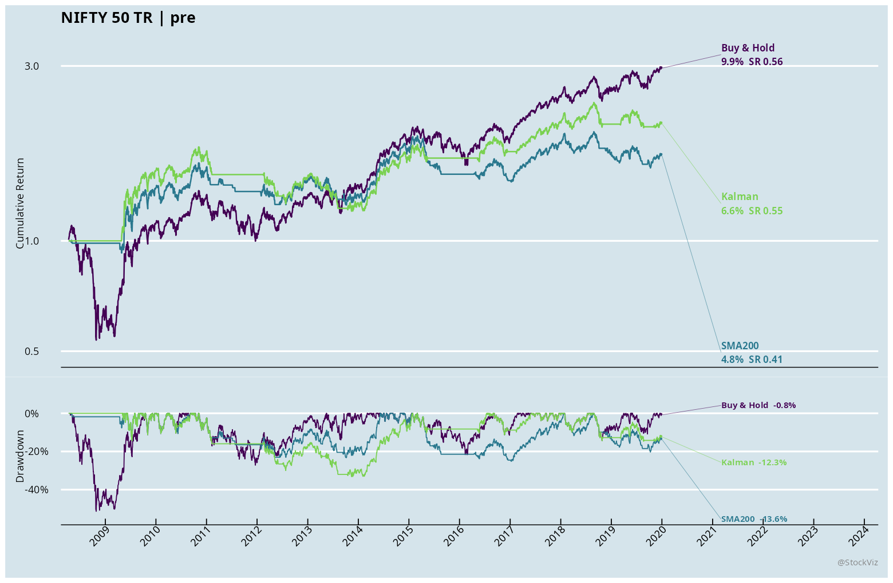

Kalman minus SMA200: CAGR +1.83 percentage points, Sharpe +0.13, MaxDD -8.05 points (positive means shallower). Exits: 10 vs 53. Lower turnover is not itself evidence of higher return or better drawdown control.

#### NIFTY MIDCAP 150 TR

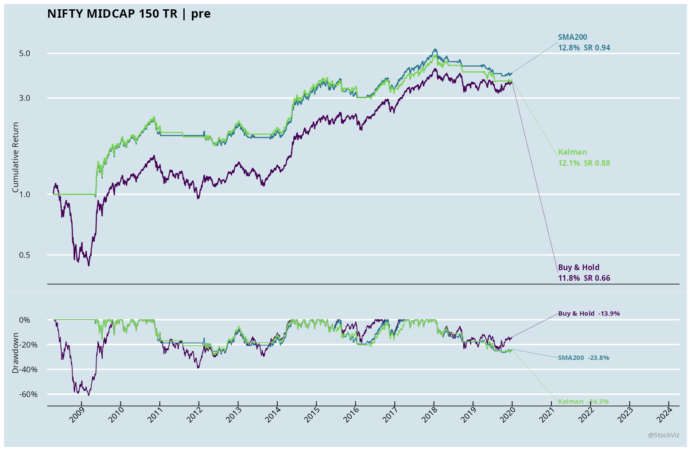

Kalman minus SMA200: CAGR -0.74 percentage points, Sharpe -0.05, MaxDD -0.90 points (positive means shallower). Exits: 11 vs 35. Lower turnover is not itself evidence of higher return or better drawdown control.

#### NIFTY SMALLCAP 250 TR

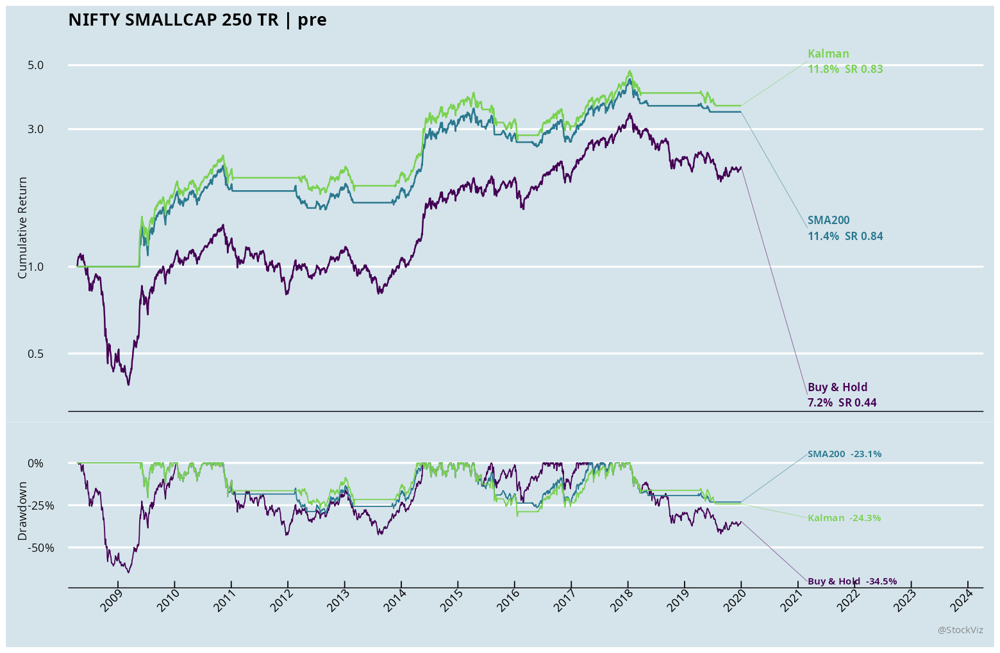

Kalman minus SMA200: CAGR +0.48 percentage points, Sharpe -0.01, MaxDD -1.85 points (positive means shallower). Exits: 9 vs 31. Lower turnover is not itself evidence of higher return or better drawdown control.

#### NIFTY BANK TR

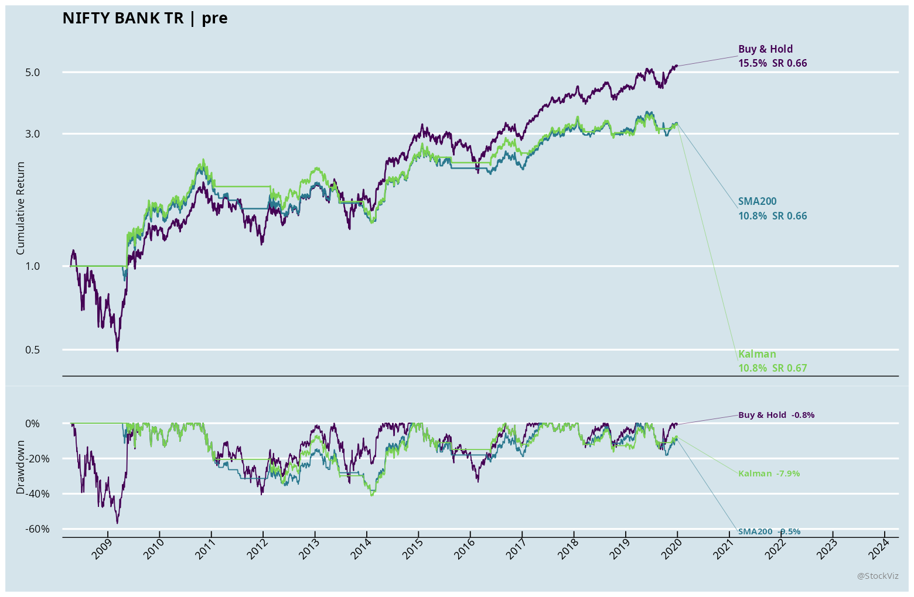

Kalman minus SMA200: CAGR -0.08 percentage points, Sharpe +0.01, MaxDD -3.25 points (positive means shallower). Exits: 10 vs 42. Lower turnover is not itself evidence of higher return or better drawdown control.

### post results

| Index | System | CAGR | Sharpe | MaxDD | Invested | Exits |
|---|---|---:|---:|---:|---:|---:|
| NIFTY 50 TR | Buy & Hold | 17.24% | 1.15 | -16.44% | 100.0% | 0 |
| NIFTY 50 TR | SMA200 | 9.63% | 0.82 | -19.50% | 78.6% | 16 |
| NIFTY 50 TR | Kalman | 10.20% | 0.88 | -15.53% | 73.7% | 4 |
| NIFTY MIDCAP 150 TR | Buy & Hold | 28.56% | 1.56 | -21.12% | 100.0% | 0 |
| NIFTY MIDCAP 150 TR | SMA200 | 21.79% | 1.48 | -14.41% | 82.6% | 10 |
| NIFTY MIDCAP 150 TR | Kalman | 19.19% | 1.32 | -17.37% | 76.4% | 4 |
| NIFTY SMALLCAP 250 TR | Buy & Hold | 30.63% | 1.52 | -26.61% | 100.0% | 0 |
| NIFTY SMALLCAP 250 TR | SMA200 | 21.33% | 1.37 | -25.46% | 76.0% | 14 |
| NIFTY SMALLCAP 250 TR | Kalman | 20.48% | 1.31 | -24.50% | 71.1% | 4 |
| NIFTY BANK TR | Buy & Hold | 18.00% | 0.92 | -20.51% | 100.0% | 0 |
| NIFTY BANK TR | SMA200 | 9.48% | 0.65 | -19.35% | 76.7% | 17 |
| NIFTY BANK TR | Kalman | 7.00% | 0.50 | -19.61% | 74.8% | 5 |

#### NIFTY 50 TR

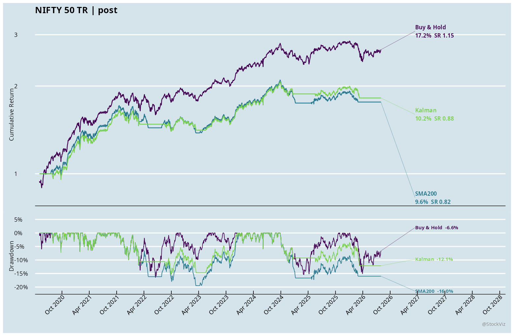

Kalman minus SMA200: CAGR +0.58 percentage points, Sharpe +0.06, MaxDD +3.97 points (positive means shallower). Exits: 4 vs 16. Lower turnover is not itself evidence of higher return or better drawdown control.

#### NIFTY MIDCAP 150 TR

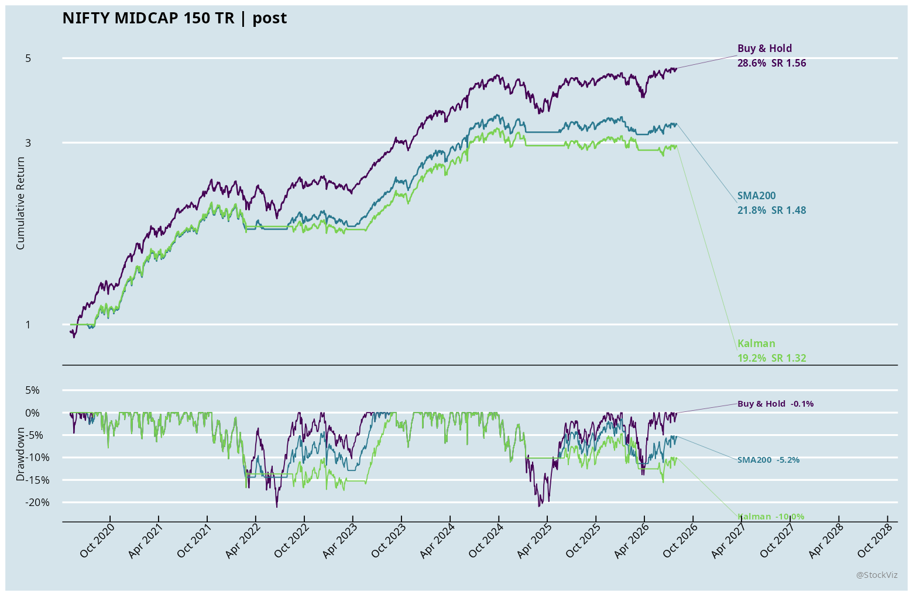

Kalman minus SMA200: CAGR -2.60 percentage points, Sharpe -0.16, MaxDD -2.96 points (positive means shallower). Exits: 4 vs 10. Lower turnover is not itself evidence of higher return or better drawdown control.

#### NIFTY SMALLCAP 250 TR

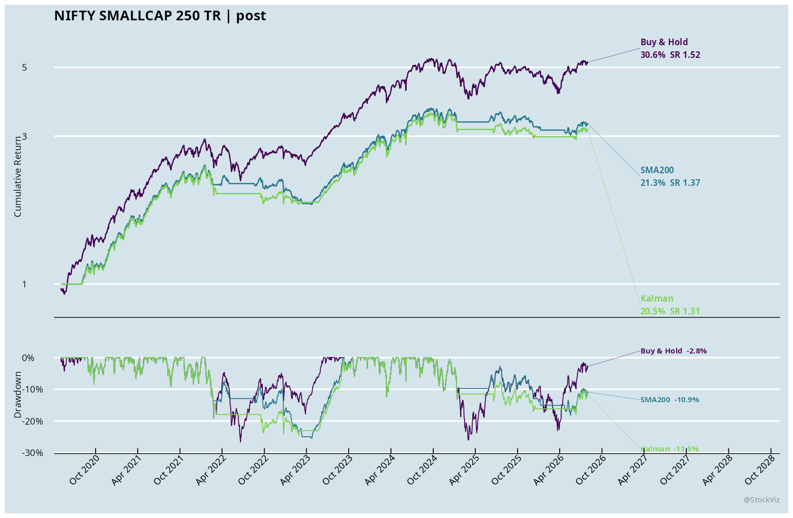

Kalman minus SMA200: CAGR -0.85 percentage points, Sharpe -0.06, MaxDD +0.96 points (positive means shallower). Exits: 4 vs 14. Lower turnover is not itself evidence of higher return or better drawdown control.

#### NIFTY BANK TR

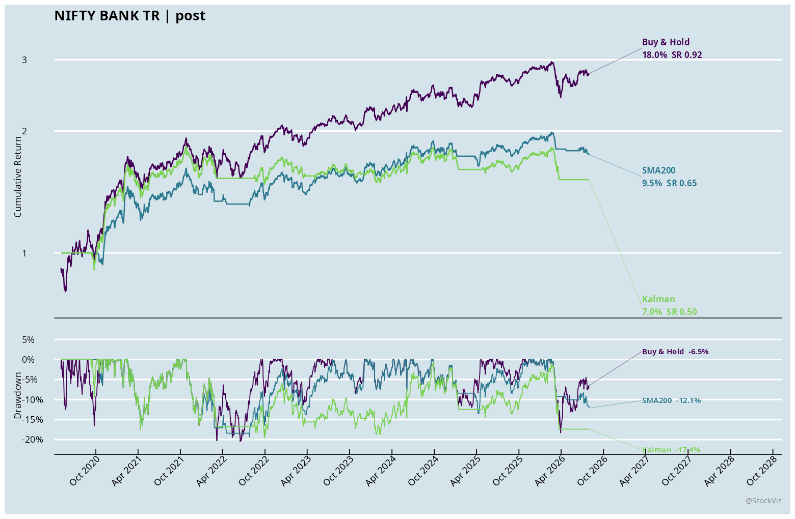

Kalman minus SMA200: CAGR -2.49 percentage points, Sharpe -0.15, MaxDD -0.26 points (positive means shallower). Exits: 5 vs 17. Lower turnover is not itself evidence of higher return or better drawdown control.

### full results

| Index | System | CAGR | Sharpe | MaxDD | Invested | Exits |
|---|---|---:|---:|---:|---:|---:|
| NIFTY 50 TR | Buy & Hold | 10.88% | 0.62 | -51.36% | 100.0% | 0 |
| NIFTY 50 TR | SMA200 | 6.07% | 0.52 | -25.18% | 72.8% | 70 |
| NIFTY 50 TR | Kalman | 6.29% | 0.53 | -34.04% | 67.7% | 15 |
| NIFTY MIDCAP 150 TR | Buy & Hold | 15.76% | 0.85 | -61.11% | 100.0% | 0 |
| NIFTY MIDCAP 150 TR | SMA200 | 15.38% | 1.10 | -27.77% | 70.4% | 46 |
| NIFTY MIDCAP 150 TR | Kalman | 12.49% | 0.89 | -44.89% | 67.2% | 16 |
| NIFTY SMALLCAP 250 TR | Buy & Hold | 12.75% | 0.69 | -64.97% | 100.0% | 0 |
| NIFTY SMALLCAP 250 TR | SMA200 | 14.14% | 1.00 | -29.75% | 62.7% | 47 |
| NIFTY SMALLCAP 250 TR | Kalman | 12.36% | 0.84 | -46.00% | 61.7% | 14 |
| NIFTY BANK TR | Buy & Hold | 13.50% | 0.61 | -56.96% | 100.0% | 0 |
| NIFTY BANK TR | SMA200 | 9.34% | 0.60 | -38.08% | 70.2% | 61 |
| NIFTY BANK TR | Kalman | 8.06% | 0.54 | -41.32% | 67.2% | 16 |

#### NIFTY 50 TR

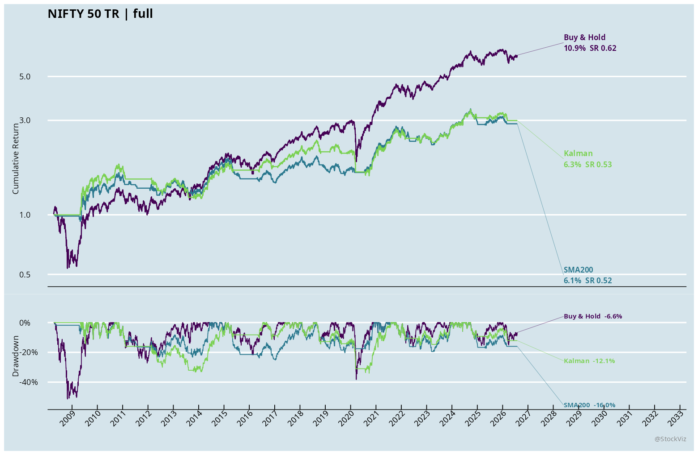

Kalman minus SMA200: CAGR +0.23 percentage points, Sharpe +0.02, MaxDD -8.86 points (positive means shallower). Exits: 15 vs 70. Lower turnover is not itself evidence of higher return or better drawdown control.

#### NIFTY MIDCAP 150 TR

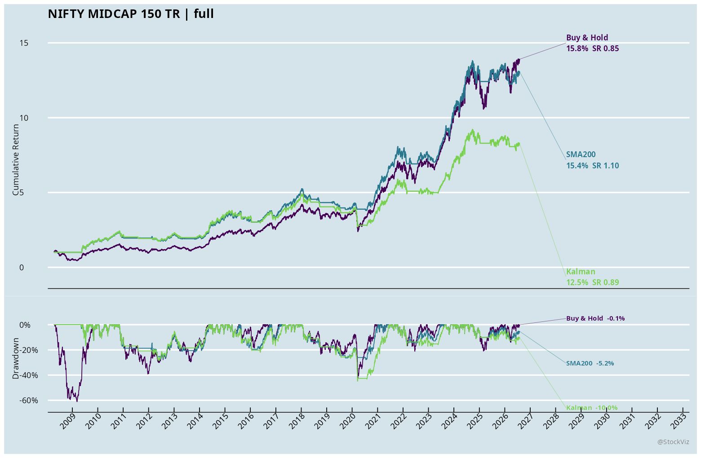

Kalman minus SMA200: CAGR -2.89 percentage points, Sharpe -0.21, MaxDD -17.13 points (positive means shallower). Exits: 16 vs 46. Lower turnover is not itself evidence of higher return or better drawdown control.

#### NIFTY SMALLCAP 250 TR

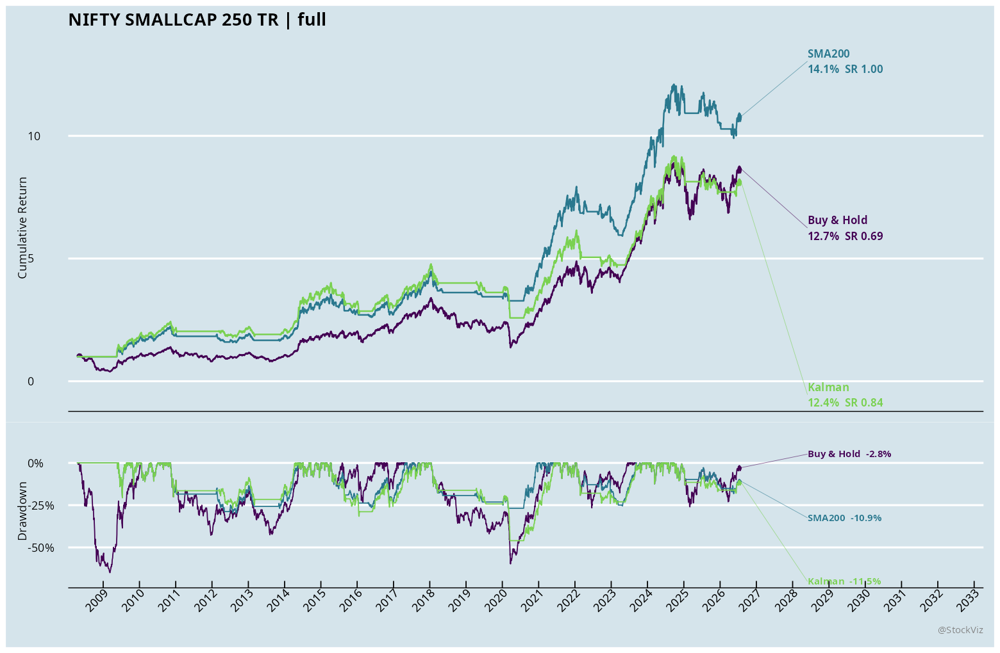

Kalman minus SMA200: CAGR -1.78 percentage points, Sharpe -0.15, MaxDD -16.24 points (positive means shallower). Exits: 14 vs 47. Lower turnover is not itself evidence of higher return or better drawdown control.

#### NIFTY BANK TR

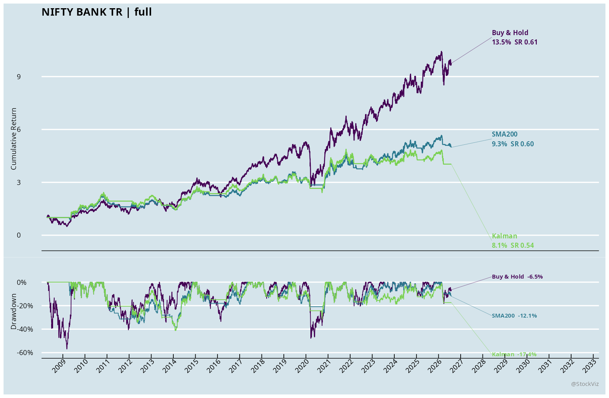

Kalman minus SMA200: CAGR -1.28 percentage points, Sharpe -0.07, MaxDD -3.25 points (positive means shallower). Exits: 16 vs 61. Lower turnover is not itself evidence of higher return or better drawdown control.
<!-- END GENERATED RESULTS -->
